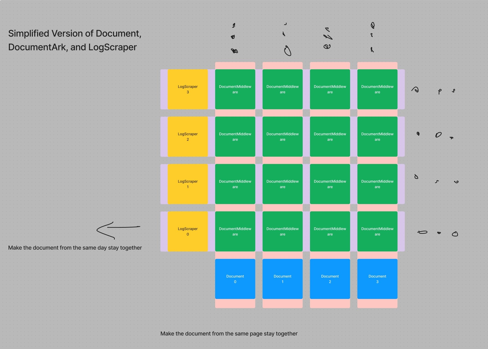

# Historical Data Management

Author: Loe

## Naive management

The task os storing HTML and non-HTML using database is more than throw all the files into the database, and call it a day. However, despite me aware so, I do not under understand the proper way of designing the schema. Consequently, I decided to adapted the even older schema used in json that date back to the first demo version. It is not a terrible design. Here is how it is laid out.

The goal of the database schema is to, first, serve the processor and web app with the latest HTML content. Then, the schema should also be able to hold the historical site data. Thus, the database schema is construct similar to a spreadsheet. The column is the website name; the row is the timestamp; and the cross section is the actual site info on a given date. Essentially, in database, the schema has three tables. The first one holds all the site. The second one holds all the timestamp. And, the third one, using the first, and the second table's content as key, holds the site snapshot on a given timestamp. It does not sound too bad, until one realize that in the real life, some sites will appear and disappear randomly for all kinds of reasons, like the site is down, or the network jittering causing the scraper failing to retrieving the site information from the Internet. Consequently, if we image our database schema as the spreadsheet, such missing values are the holes in the table. It is very not desirable, because it is a pain to maintain the inconsistent table with holes in. As a result, in the loading part of the code, I need to cover a lot of corner cases to maintain the data integrity. It is not fun, because no one wants to spend ours using cli trying to fix a hole in the database. More importantly, every time the processor, which digests and indexes the site, would like decide if one site has changed or not, the database needs to compare the one block in the spreadsheet to the last one. If I would like to know if one site's change in a time span, I need to make many comparison, which is inefficient for both storage usage optimization and further scaling search scope.

In the illustration, one distinct site is named as one document, and one distinct timestamp is named as a LogScraper. Sounds lovely. The cross section is named document ark that stores the actual HTML page. It has multiple states and is represented by different color. The table expands both vertically and horizontally.

## Improved management

In one major iteration, I redesigned the database schema to fix all the problems that discovered in the previous one. The new design is mostly the same as the old one, but one more table for storing raw HTML file was added. The original spreadsheet structure remained unchanged. However, to address the hole problem, the cross section, or block, of a given row and colum is no longer an actual HTML content, instead, it is a reference to the content in the forth table, the one that stores the actual HTML. By designing the database this way, when a known site is missing in one day's scraping operation, instead of leaving a hole in the spreadsheet, the database could populate it with a normal block, saying "Nan, page go missing. No page for today." In the scenario where the page remain unchanged, instead of keeping two same HTML in the database as the old schema did, the database will reference the same HTML page again in the forth table. Consequently, the database is able deduplicate and store the HTML way more efficiently. Lovely.

\
In the illustration, compare to former schema, the spreadsheet is now fully populated, good for my monkey brain.

\
This illustration shows the foreign key relationship in a typical scenario. Multiple Document Middleware refers to one Document Ark, which holds the actual HTML. The Document Ark than points to the original site.
